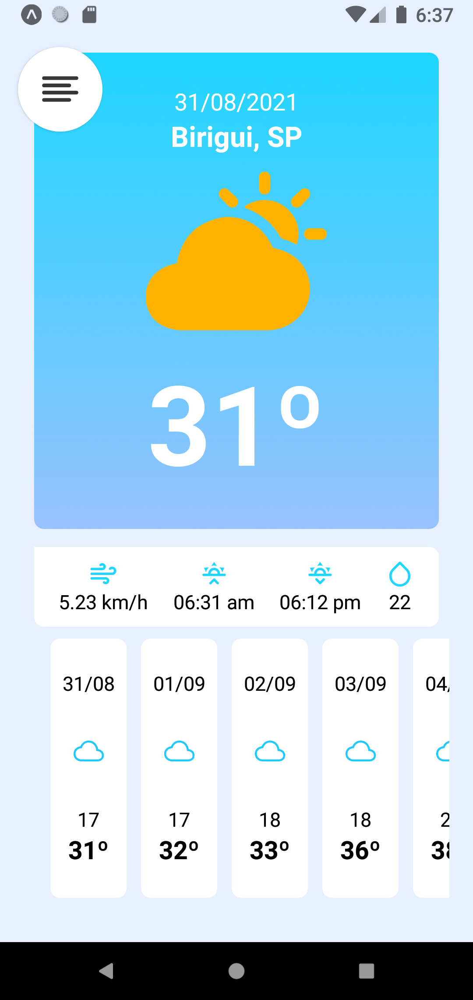
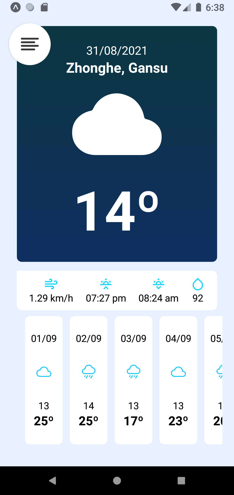
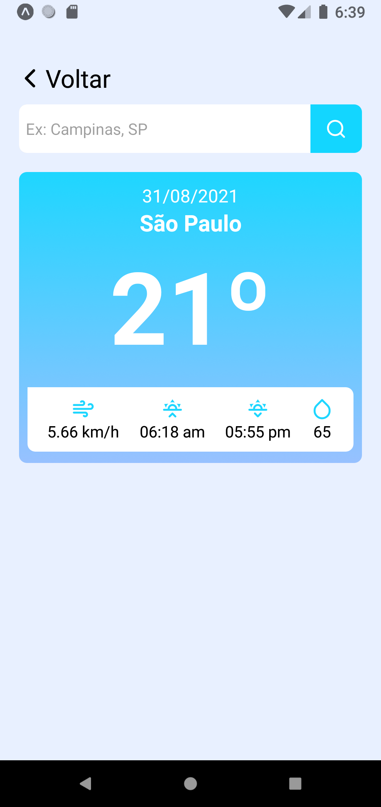

<h1 align="center">
  
  

  
  
</h1>

  <a href="#title">Projeto</a>&nbsp;&nbsp;&nbsp;|&nbsp;&nbsp;&nbsp; 
  <a href="#preview">Layout</a>&nbsp;&nbsp;&nbsp;|&nbsp;&nbsp;&nbsp;
  <a href="#technologies">Tecnologias</a>&nbsp;&nbsp;&nbsp;|&nbsp;&nbsp;&nbsp; 
  <a href="#license">Licença</a>

<h1 id="title">💻 Projeto</h1>

&nbsp;O Insider é um evento que o <a href="https://instagram.com/sujeitoprogramador">Sujeito Programador</a> disponibiliza ao público e em cada temporada ele trás uma proposta de aplicativo diferente.

&nbsp;Você não precisa ter conhecimento algum para participar, pois ele sempre ensina do zero ao app ou seja, você consegue fazer sem saber nada de programação e assim que finalizar você vai ter uma vasta experiência na área.

&nbsp;No Insider 2.0 a proposta foi criar um aplicativo mobile(android/ios) onde você ver a temperatura e algumas informações sobre o clima na sua região, além de poder também pesquisar o clima em outras regiões.

<h2 id="preview">🔖 Layout</h2>

  
  
  

<h2 id="technologies">✨ Tecnologias</h2>

As seguintes ferramentas foram usadas na construção do projeto:

- [Node.js](https://nodejs.org/en/)
- [React Native](https://reactnative.dev/)
- [Axios](https://github.com/axios/axios)

<h2 id="license">📄 Licença</h2>

Esse projeto está sob a licença MIT. Veja o arquivo [LICENSE](LICENSE.md) para mais detalhes.
